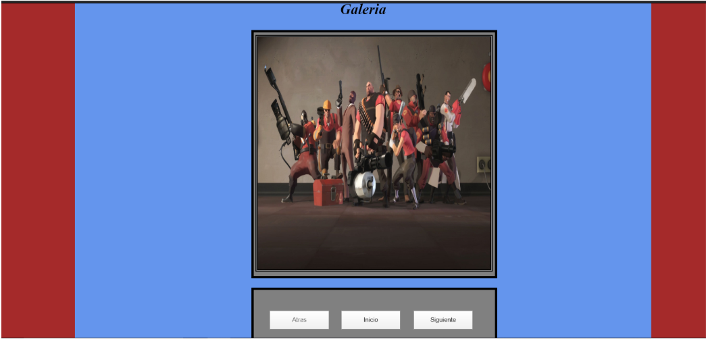

# -Practica03-Javascript
Practica 3 Estudiando Javascript
-------------------------------------
Juan Francisco Pelaez Becerra
Hipermedial
Univesidad Politenica Salesiana
---------------------------------------
Formulario:

Revisar Campos Incorrectos

Verificar si se encuentra correcto

Validación de Todos los campos:

Si es validado, se dirige al archivo php

Campos Vacíos se resaltan y no pasa la validación

Mensajes personalizados por campo

Galería:

Imagenes Randomicas:

Calculadora:

Código Validaciones:

HTML:

Javascript:

CSS:

Galería De Fotos:

HTML:

Javascript:

CSS:

Calculadora:
HTML:

Javascript:

CSS:

--------------------------------------------------------------------------------------------------------------------------------------------------------

/*/*/   GITHUB LINK : https://github.com/PelaezFrancisco/-Practica03-Javascript

/*/*/   USUARIO: PelaezFrancisco

--------------------------------------------------------------------------------------------------------------------------------------------------------

